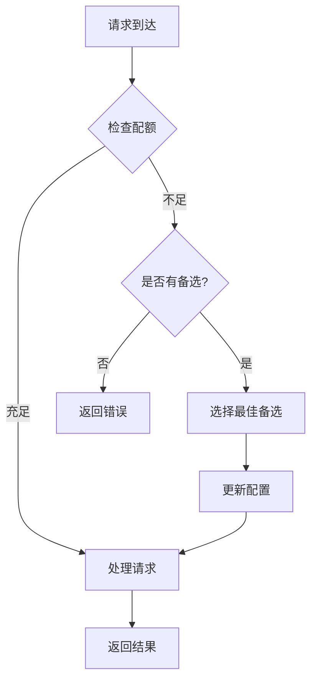

# LLM 订阅套餐限额智能切换功能需求文档

## 📋 文档信息

| 项目 | 内容 |
|------|------|
| **文档版本** | v1.0 |
| **创建日期** | 2026-02-22 |
| **状态** | 需求细化 |
| **优先级** | 高 |
| **目标项目** | OpenClaw-Claude |

---

## 🎯 功能概述

### 核心目标
当当前使用的 LLM 订阅套餐即将达到限额或已经达到限额时，系统自动优雅地切换到其他可用的订阅套餐或已注册且余额充足的 LLM 提供商，确保服务不中断。

### 主要价值
- ✅ 避免因配额耗尽导致的服务中断
- ✅ 自动化降级策略，提升系统可用性
- ✅ 优化成本，优先使用性价比高的套餐
- ✅ 透明的配额监控和告警

---

## 🔍 需求背景

### 当前问题

1. **配额耗尽风险**
   - 单一 LLM 提供商配额用尽后，服务中断
   - 需要手动切换，响应慢

2. **成本优化不足**
   - 无法根据实际使用动态选择最优套餐
   - 未充分利用多个提供商的免费额度

3. **监控缺失**
   - 没有配额使用监控
   - 无法提前预警

4. **切换体验差**
   - 切换过程不透明
   - 可能导致请求失败

### 用户痛点

1. **开发者**
   - 集成多个 LLM 提供商复杂
   - 需要手动管理配额和切换
   - 成本控制困难

2. **企业用户**
   - 服务可用性要求高
   - 需要透明的成本监控
   - 要求符合预算的自动切换

---

## 💡 功能需求

### 1. 配额监控

#### 1.1 实时配额查询

**需求描述：**
系统应能够实时查询当前使用的 LLM 提供商的配额使用情况。

**功能点：**
- [ ] 查询剩余配额（tokens/requests）
- [ ] 查询配额有效期
- [ ] 查询套餐类型和等级
- [ ] 查询历史使用趋势

**技术实现：**

**方案 1：API 查询（支持实时查询的提供商）**

适用于：DeepSeek、Anthropic

- 通过各提供商 API 查询配额
- 定期缓存配额信息（如 5 分钟）
- 支持手动刷新

**数据来源：**
- DeepSeek：`https://api.deepseek.com/v1/usage`
- Anthropic：`https://api.anthropic.com/v1/messages`（响应中的 `usage` 字段）

**方案 2：错误检测（不支持实时查询的提供商）**

适用于：GLM、阿里云、Kimi、MiniMax

- 监听 HTTP 429（Too Many Requests）错误
- 统计请求次数和 token 使用量
- 基于套餐信息估算配额使用

**套餐信息配置示例：**
```yaml
providers:
  zhipu:
    quota:
      type: "5hour_limit"  # 5小时限额
      limit: 100000  # 100K tokens/5小时
      reset_time: "05:00:00"  # 每天早上5点刷新
      detection_method: "error_429"

  aliyun:
    quota:
      type: "5hour_limit"
      limit: 200000  # 200K tokens/5小时
      reset_time: "08:00:00"
      detection_method: "error_429"
```

**混合策略：**

对于 5 小时限额套餐：
1. 当首次遇到 429 错误时，记录当前时间
2. 暂时禁用该提供商 5 小时
3. 切换到备用提供商
4. 5 小时后重新启用该提供商

#### 1.2 配额使用预测

**需求描述：**
根据历史使用数据，预测何时会达到配额限额。

**功能点：**
- [ ] 计算平均使用率（tokens/小时）
- [ ] 预测配额耗尽时间
- [ ] 显示使用趋势图
- [ ] 提供配额使用建议

**算法：**
- 使用滑动窗口计算平均使用率
- 线性回归预测
- 考虑周期性使用模式

#### 1.3 配额告警

**需求描述：**
当配额使用达到阈值时，发送告警通知。

**功能点：**
- [ ] 预警阈值配置（如 80%、90%、95%）
- [ ] 多渠道通知（邮件、Webhook、Feishu）
- [ ] 告警消息模板
- [ ] 告警频率控制（避免轰炸）

**通知内容：**
```
⚠️ LLM 配额预警

提供商：智谱 GLM
套餐：Pro 版
当前使用：95%
剩余配额：500K tokens
预计耗尽时间：2 小时后

建议操作：
- 立即切换到备用提供商
- 升级套餐
- 停止非关键请求
```

---

### 2. 智能切换策略

#### 2.1 切换触发条件

**需求描述：**
定义何时触发自动切换。

**触发条件：**
- [ ] 配额使用率 ≥ 90%（可配置）
- [ ] 配额已耗尽（API 返回 429）
- [ ] 配额即将过期（如 1 小时内）
- [ ] 手动触发切换

#### 2.2 切换优先级

**需求描述：**
定义多个备选提供商的切换优先级。

**优先级规则：**

| 优先级 | 规则 | 说明 |
|--------|------|------|
| 1 | 剩余配额充足 | 配额 > 100K tokens |
| 2 | 套餐等级 | Pro > Standard > Free |
| 3 | 成本 | 选择 token 价格最低的 |
| 4 | 响应时间 | 选择延迟最低的 |
| 5 | 成功率 | 选择历史成功率最高的 |

**配置示例：**
```yaml
fallback_providers:
  - provider: zhipu
    priority: 1
    min_balance: 100000
    tier: ["pro", "standard"]

  - provider: aliyun
    priority: 2
    min_balance: 50000
    tier: ["standard", "free"]

  - provider: deepseek
    priority: 3
    min_balance: 20000
    tier: ["free"]
```

#### 2.3 切换策略

**需求描述：**
定义不同的切换策略。

**策略类型：**

1. **降级策略**（推荐）
   - 优先级：高 → 低
   - 从高性能套餐切换到普通套餐
   - 适用于非关键请求

2. **成本优化策略**
   - 优先选择价格最低的
   - 适用于批量处理
   - 不考虑性能

3. **性能优先策略**
   - 优先选择性能最好的
   - 适用于关键请求
   - 不考虑成本

4. **负载均衡策略**
   - 按请求量分配到多个提供商
   - 充分利用所有配额
   - 适用于高并发场景

#### 2.4 切换机制

**需求描述：**
定义切换的具体执行方式。

**切换方式：**

1. **请求级切换**
   - 单个请求失败后切换
   - 重新发送请求
   - 透明对调用方

2. **会话级切换**
   - 整个会话切换提供商
   - 保持上下文一致
   - 适用于对话场景

3. **全局切换**
   - 所有新请求切换到新提供商
   - 原有请求继续完成
   - 平滑过渡

**切换流程：**


---

### 3. 配置管理

#### 3.1 多提供商配置

**需求描述：**
支持配置多个 LLM 提供商及其套餐信息。

**配置格式：**
```yaml
llm_providers:
  zhipu:
    name: "智谱 GLM"
    api_key: "${ZHIPU_API_KEY}"
    base_url: "https://openbigmodel.cn/api/anthropic"
    models:
      default: "glm-4-flash"
      fallback: "glm-4"
    quota:
      type: "subscription"
      tier: "pro"
      total: 1000000  # 1M tokens
      renewal: "monthly"
      warning_thresholds: [0.8, 0.9, 0.95]

  aliyun:
    name: "阿里云百炼"
    api_key: "${ALIYUN_API_KEY}"
    base_url: "https://dashscope.aliyuncs.com/compatible-mode/v1"
    models:
      default: "qwen3.5-plus"
      fallback: "qwen3.5-turbo"
    quota:
      type: "pay_as_you_go"
      balance: 500000  # 500K tokens
      warning_thresholds: [0.7, 0.9]
```

#### 3.2 切换策略配置

**需求描述：**
配置切换触发条件和优先级。

**配置格式：**
```yaml
auto_fallback:
  enabled: true
  strategy: "degrade"  # degrade | cost_optimize | performance_first | load_balance

  triggers:
    quota_threshold: 0.9  # 90%
    on_429: true
    on_expiry: true
    manual: true

  priority_rules:
    - rule: "balance_sufficient"
      condition: "remaining_quota > 100000"

    - rule: "tier_higher"
      condition: "tier in ['pro', 'standard']"

    - rule: "cost_lower"
      condition: "input_price < 0.01"

  retry_on_fallback:
    max_retries: 3
    backoff: "exponential"
    initial_delay: 1000  # ms
```

#### 3.3 告警配置

**需求描述：**
配置告警渠道和消息。

**配置格式：**
```yaml
alerts:
  enabled: true
  channels:
    - type: "email"
      recipients: ["admin@example.com"]
      template: "email_alert.html"

    - type: "webhook"
      url: "${WEBHOOK_URL}"
      method: "POST"
      headers:
        Content-Type: "application/json"

    - type: "feishu"
      webhook_url: "${FEISHU_WEBHOOK_URL}"
      template: "feishu_alert.json"

  throttle:
    max_per_hour: 5
    cooldown: 300  # seconds
```

---

### 4. 用户体验

#### 4.1 配额可视化

**需求描述：**
提供直观的配额使用展示。

**展示内容：**
- [ ] 配额使用进度条
- [ ] 使用趋势图（7 天）
- [ ] 各提供商配额对比
- [ ] 预测配额耗尽时间

**UI 示例：**
```
┌─────────────────────────────────────────┐
│ LLM 配额监控                            │
├─────────────────────────────────────────┤
│ 智谱 GLM (Pro)                         │
│ ███████████████████░░░░░░░ 85%         │
│ 剩余：150K tokens  |  预计：4小时后    │
│                                         │
│ 阿里云百炼 (按量)                       │
│ ████████░░░░░░░░░░░░░░░ 40%          │
│ 余额：300K tokens  |  ¥30.00           │
│                                         │
│ DeepSeek (Free)                         │
│ ████░░░░░░░░░░░░░░░░░░░ 20%         │
│ 剩余：200K tokens  |  今天刷新          │
└─────────────────────────────────────────┘
```

#### 4.2 切换通知

**需求描述：**
在切换时通知用户。

**通知内容：**
```
🔄 LLM 提供商已切换

从：智谱 GLM (Pro)
到：阿里云百炼 (Standard)

原因：智谱 GLM 配额使用率达 90%

下次检查：5 分钟后
恢复条件：配额充足后自动切回
```

#### 4.3 手动控制

**需求描述：**
允许用户手动控制切换。

**功能点：**
- [ ] 手动切换提供商
- [ ] 禁用自动切换
- [ ] 设置固定提供商
- [ ] 查看切换历史

**命令示例：**
```bash
# 查看当前配置
llm-config status

# 手动切换
llm-config switch --to aliyun

# 禁用自动切换
llm-config auto-fallback --disable

# 查看切换历史
llm-config history
```

---

### 5. 性能要求

#### 5.1 响应时间

**需求描述：**
切换过程不应影响用户体验。

**性能指标：**
- 配额查询：< 500ms
- 切换决策：< 100ms
- 重试延迟：< 5s
- 总体切换时间：< 10s

#### 5.2 可用性

**需求描述：**
确保切换过程的高可用性。

**可用性指标：**
- 切换成功率：> 99%
- 备选提供商可用性：> 95%
- 系统可用性：> 99.9%

#### 5.3 扩展性

**需求描述：**
支持动态添加新的提供商。

**扩展性要求：**
- 配置驱动，无需代码修改
- 支持插件式提供商适配器
- 支持自定义切换策略

---

### 6. 安全性要求

#### 6.1 API 密钥保护

**需求描述：**
保护各提供商的 API 密钥。

**安全措施：**
- [ ] 加密存储 API 密钥
- [ ] 不在日志中暴露密钥
- [ ] 支持密钥轮换
- [ ] 密钥访问审计

#### 6.2 访问控制

**需求描述：**
控制谁能配置和查看配额。

**访问控制：**
- [ ] 基于角色的权限（RBAC）
- [ ] 操作审计日志
- [ ] 敏感操作二次确认

---

### 7. 测试需求

#### 7.1 单元测试

**测试覆盖：**
- [ ] 配额查询逻辑
- [ ] 切换优先级计算
- [ ] 告警触发逻辑
- [ ] 配置解析

**测试用例数：** ≥ 30

#### 7.2 集成测试

**测试场景：**
- [ ] 配额耗尽触发切换
- [ ] 多提供商切换
- [ ] 告警发送
- [ ] 配置热更新

**测试用例数：** ≥ 15

#### 7.3 压力测试

**测试指标：**
- [ ] 并发请求下的切换性能
- [ ] 大量配置的加载速度
- [ ] 长时间运行的稳定性

---

## 🗂️ 数据模型

### Provider（提供商）

```yaml
id: str                    # 唯一标识
name: str                  # 显示名称
api_key: str               # API 密钥（加密）
base_url: str              # API 基础 URL
models:
  default: str             # 默认模型
  fallback: str            # 降级模型
quota:
  type: enum              # subscription | pay_as_you_go
  tier: str                # free | standard | pro | enterprise
  total: int               # 总配额
  remaining: int           # 剩余配额
  renewal: str             # monthly | yearly | never
  expiry: datetime         # 过期时间
  last_sync: datetime      # 最后同步时间
```

### FallbackEvent（切换事件）

```yaml
id: str
timestamp: datetime
from_provider: str
to_provider: str
reason: str
success: bool
error: str                # 失败原因
```

### Alert（告警）

```yaml
id: str
timestamp: datetime
provider: str
type: str                 # warning | critical
message: str
status: str               # pending | sent | failed
sent_at: datetime
```

---

## 📊 技术实现建议

### 架构设计

```
┌─────────────────────────────────────────────┐
│             Application Layer                │
│  (OpenClaw-Claude / Claude Code / etc.)     │
└─────────────────┬───────────────────────────┘
                  │
┌─────────────────▼───────────────────────────┐
│          LLM Client SDK                    │
│  - Multi-provider support                  │
│  - Automatic fallback                      │
└─────────────────┬───────────────────────────┘
                  │
┌─────────────────▼───────────────────────────┐
│     Provider Manager                       │
│  - Provider registry                      │
│  - Quota monitoring                       │
│  - Health check                           │
└─────────────────┬───────────────────────────┘
                  │
        ┌─────────┴─────────┐
        │                   │
┌───────▼────────┐  ┌─────▼──────────┐
│  Quota Monitor  │  │  Alert Engine  │
│  - Usage track  │  │  - Threshold   │
│  - Prediction   │  │  - Notification│
└─────────────────┘  └────────────────┘
```

### 核心组件

1. **ProviderManager**
   - 管理所有提供商配置
   - 提供商注册和发现
   - 健康检查

2. **QuotaMonitor**
   - 实时监控配额使用
   - 预测配额耗尽
   - 触发告警

3. **FallbackEngine**
   - 执行切换策略
   - 选择最佳备选
   - 管理切换历史

4. **AlertEngine**
   - 管理告警规则
   - 发送通知
   - 节流控制

### 技术栈推荐

- **语言**: Python 3.11+
- **框架**: FastAPI / Flask
- **数据库**: SQLite / PostgreSQL
- **缓存**: Redis
- **消息队列**: Celery / RQ
- **监控**: Prometheus + Grafana
- **日志**: ELK Stack

---

## 📅 开发计划

### Phase 1: 基础功能（2 周）

**目标：**
- 实现配额监控
- 实现基本的切换逻辑
- 支持配置管理

**交付物：**
- [ ] ProviderManager
- [ ] QuotaMonitor
- [ ] 基本切换策略
- [ ] 配置管理

### Phase 2: 告警和通知（1 周）

**目标：**
- 实现告警引擎
- 支持多渠道通知
- 告警模板管理

**交付物：**
- [ ] AlertEngine
- [ ] 通知渠道适配器
- [ ] 告警模板

### Phase 3: 用户体验（1 周）

**目标：**
- 实现配额可视化
- CLI 命令
- 切换历史

**交付物：**
- [ ] 可视化界面
- [ ] CLI 命令行工具
- [ ] 切换历史查询

### Phase 4: 优化和测试（1 周）

**目标：**
- 性能优化
- 完整测试覆盖
- 文档完善

**交付物：**
- [ ] 性能优化
- [ ] 完整测试套件
- [ ] 用户文档

**总周期：** 5 周

---

## ✅ 验收标准

### 功能验收

- [ ] 支持至少 3 个 LLM 提供商
- [ ] 配额准确率：> 99%
- [ ] 切换成功率：> 99%
- [ ] 告警发送成功率：> 95%
- [ ] 配置热更新无需重启

### 性能验收

- [ ] 配额查询：< 500ms
- [ ] 切换决策：< 100ms
- [ ] 总体切换时间：< 10s
- [ ] 系统可用性：> 99.9%

### 质量验收

- [ ] 单元测试覆盖率：≥ 80%
- [ ] 集成测试用例：≥ 15
- [ ] 文档完整性：100%
- [ ] 代码审查通过

---

## 📚 附录

### A. 支持的 LLM 提供商

| 提供商 | 配额查询 API | 切换支持 | 5小时限额支持 | 说明 |
|--------|-------------|----------|--------------|------|
| 智谱 GLM | ❌ | ✅ | ❓ | 5小时限额套餐不支持实时配额查询，通过 429 错误检测 |
| 阿里云百炼 | ❌ | ✅ | ❓ | 通过 DashScope 控制台查询，API 不直接支持配额查询 |
| DeepSeek | ✅ | ✅ | ✅ | 支持 `/v1/usage` 端点查询使用情况 |
| Moonshot Kimi | ❌ | ✅ | ❓ | 通过控制台查询，API 不直接支持配额查询 |
| MiniMax | ❌ | ✅ | ❓ | 通过控制台查询，API 不直接支持配额查询 |
| Anthropic | ✅ | ✅ | ✅ | 支持 `/v1/messages` 响应中的 `usage` 字段 |

**重要说明：**
- ✅ **实时配额查询**：支持通过 API 直接查询剩余配额
- ❌ **非实时查询**：无法通过 API 直接查询，需要通过其他方式：
  - 通过 HTTP 429（Too Many Requests）错误检测配额耗尽
  - 通过控制台手动查询
  - 通过历史使用记录估算
- ❓ **5小时限额**：GLM 和阿里云的 5 小时限额套餐通常不支持实时配额查询，只能通过错误响应检测

**配额监控策略：**

1. **有配额 API 的提供商**（DeepSeek、Anthropic）：
   - 定期调用配额查询 API
   - 实时显示剩余配额
   - 预测配额耗尽时间

2. **无配额 API 的提供商**（GLM、阿里云、Kimi、MiniMax）：
   - 通过 429 错误检测配额耗尽
   - 跟踪请求次数和使用量
   - 基于历史数据估算配额使用
   - 当达到 429 错误时触发切换

### B. 术语表

| 术语 | 说明 |
|------|------|
| **Quota** | 配额，token 使用限制 |
| **Tier** | 套餐等级（Free/Standard/Pro/Enterprise） |
| **Fallback** | 降级，切换到备选提供商 |
| **Throttle** | 节流，限制告警频率 |
| **Backoff** | 退避，重试延迟策略 |

### C. 参考资料

- Claude Code 文档：https://docs.anthropic.com/en/docs/claude-code/overview
- OpenClaw 文档：https://docs.openclaw.ai
- 智谱 GLM 文档：https://open.bigmodel.cn/dev/api
- 阿里云百炼文档：https://help.aliyun.com/dashscope

---

**文档结束**

**下一步行动：**
1. [ ] 评审需求文档
2. [ ] 确认技术方案
3. [ ] 开始 Phase 1 开发
